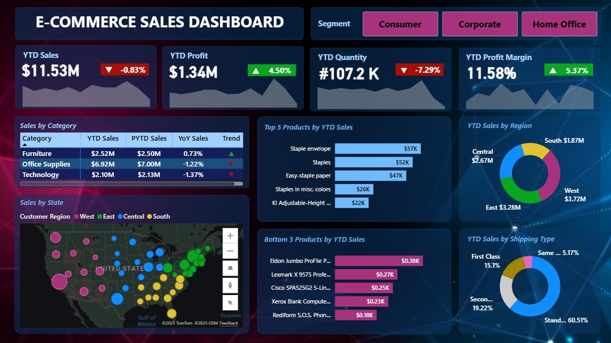
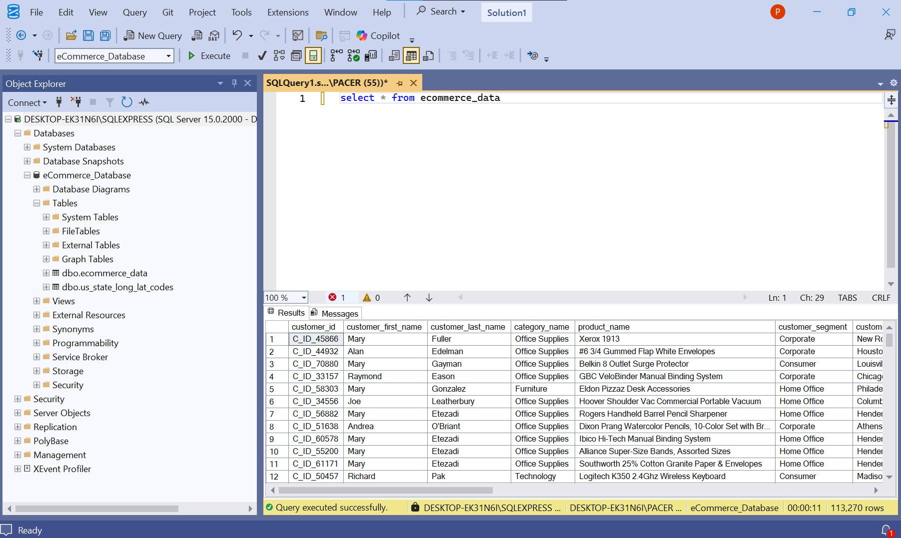

# E-Commerce Sales Performance Dashboard (Power BI)

### Overview
This Power BI report provides an interactive analysis of **sales performance** across multiple business dimensions.  
The dashboard enables users to explore metrics such as **year-to-date (YTD)** and **previous year-to-date (PYTD)** dynamically, offering insights into overall business performance, profitability, and year-on-year growth trends.

---

### Key Performance Indicators (KPIs)
- **YTD Sales** – Total cumulative sales for the current year.  
- **PYTD Sales** – Sales for the same period in the previous year.  
- **YTD Sales Quantity** – Total units sold during the current year.  
- **YTD Profit** – Net profit accumulated from all sales within the current year.  
- **YTD Profit Margin** – Percentage of profit relative to total revenue.  
- **YoY Sales Growth (Sales)** – Year-on-year comparison of total sales performance.  
- **YoY Sales Growth (Profit)** – Year-on-year change in total profit.  
- **YoY Sales Growth (Quantity)** – Year-on-year change in the number of units sold.  
- **YoY Sales Growth (Profit Margin)** – Year-on-year variation in profit margin percentage.  

These KPIs provide a full picture of both short-term performance and long-term business trends.

---

### Dimensions of Analysis
The dashboard allows dynamic filtering and visualization based on:
- **Product Segment** – Compare performance across different product categories.  
- **Sales Region** – Analyze geographical sales distribution and contribution by state and region.
- **Top 5 and Bottom 5 Products** – Identify the best- and worst-performing products based on sales and profit metrics.  
- **Shipping Style** – Assess the impact of different delivery methods on performance.    

---

### Insights
- Compare current and previous year’s performance across all KPIs.  
- Identify top-performing segments and regions contributing most to revenue.  
- Detect underperforming products and optimize inventory or pricing strategies.  
- Examine how shipping choices affect both customer satisfaction and profitability.  
- Use interactive slicers and hover tooltips to dynamically explore trends and performance details.

---

### Tools & Technologies
- **Power BI Desktop**  
- **MS SQL Server** – Primary data source for importing and transforming structured sales data.  
- **Power Query** – For data cleaning, modeling, and shaping.  
- **DAX (Data Analysis Expressions)** – For calculated measures and dynamic KPIs.  
- **Excel/CSV** – Supporting data sources for supplementary analysis.  

---

### How to Use
1. Download the `.pbix` file from this repository.  
2. Open it in **Power BI Desktop (version 2024 or later)**.  
3. Use the **segment slicer** at the top to filter KPIs dynamically.  
4. Hover over visuals for detailed tooltips and interactive analysis.  

---

### Dashboard Preview

---

### Author
**Patience Keter**  
Location: Nairobi, Kenya  
Website: www.linkedin.com/in/patience-keter  
Email: paceketer7@gmail.com

---

**Disclaimer!** This project is for demonstration and educational purposes only. All data used is either simulated or anonymized for analysis.
